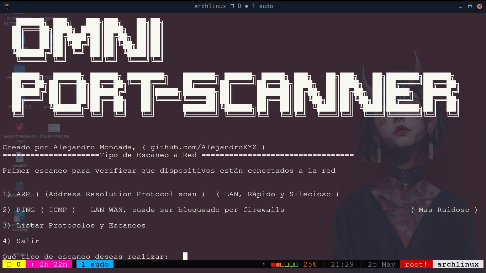
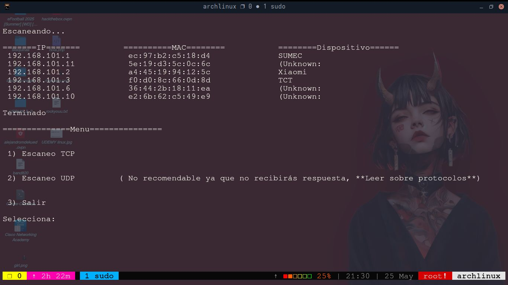

# 🧠Omni-PortScanner – Escáner de Puertos Educativo sin Nmap

🔍 Omni-PortScanner es un escáner de puertos hecho en Bash que permite analizar dispositivos 
conectados a la red local y sus puertos abiertos utilizando diferentes técnicas de escaneo.

Es una herramienta didáctica enfocada en enseñar cómo funcionan los protocolos ICMP, TCP, UDP y ARP
desde el punto de vista del análisis de red, sin depender de nmap . 

🛠️   ## Características Principales

✅ Escaneo de dispositivos en la red usando ARP (silencioso) o ICMP (ping)
✅ Escaneo de puertos con TCP y UDP
✅ Interfaz interactiva en consola
✅ Muestra información sobre MACs y fabricantes de dispositivos
✅ No requiere nmap, solo dependencias básicas como nc y arp-scan
✅ Ideal para aprendizaje práctico de redes y seguridad informática

📦 ##	Dependencias

Al ejecutar el script las instala automaticamente.

•	netcat

•	arp-scan

🚀 ## Cómo Usarlo

Clona el repositorio:
bash

1)
git clone https://github.com/tu-usuario/Omni-PortScanner.git 
cd Omni-PortScanner
Da permisos de ejecución al script:

2)
chmod +x Omni-PortScanner.sh
Ejecuta el script como root:

3)
sudo ./Omni-PortScanner.sh

4)
Sigue las instrucciones en pantalla:
Selecciona tipo de escaneo inicial (ARP o PING)
Luego escoge escaneo de puertos (TCP o UDP)
Puedes explorar también información sobre protocolos y tipos de escaneo

🧪 ## Tipos de Escaneo Soportados

ARP, ICMP(ping), UDP, TCP

📁 Estructura del Proyecto

Omni-PortScanner/
├── Omni-PortScanner.sh     # Script principal
├── .banner.ascii           # Banner ASCII del programa
└── .info/                  # Información educativa sobre protocolos
    ├── icmp.txt
    ├── ping.txt
    ├── tcp.txt
    └── udp.txt

📘 ## Notas Educativas

Este script está pensado únicamente para entornos controlados y fines educativos . 
No debe usarse en redes ajenas sin autorización expresa.

##	¿Qué aprenderás?

	• Uso básico de protocolos de red (ICMP, TCP, UDP, ARP)
	• Escaneo de puertos sin herramientas especializadas
	• Gestión de procesos concurrentes en Bash
	• Análisis de tráfico y dispositivos en red local

⚠️ A## dvertencias
Este script puede ser detectado por algunos sistemas de detección de intrusos.
Algunas funciones requieren privilegios elevados (root), especialmente el escaneo ARP.
El escaneo UDP puede no devolver resultados claros ya que muchos puertos no responden.

💬 ## Contribuye
¡Cualquier mejora, corrección o traducción es bienvenida!
Si tienes ideas para añadir más tipos de escaneo, mejorar la interfaz o agregar soporte IPv6,
¡no dudes en contribuir!

👤 ## Autor
👤 Alejandro Moncada

#### GitHub: AlejandroXYZ

#### Correo: [Mi_correo](emailto:alejandromdekuedit@gmail.com)

#### Linkedin: [Mi_perfil](https://www.linkedin.com/in/alejandroxyz/)

🌟 ¡Gracias por usar Omni-PortScanner !
Esperamos que te sirva para aprender y experimentar con redes de forma segura y ética.
¡Happy Hacking! 💻🔐

No uses esta herramienta en redes donde no tengas permiso explícito.
El conocimiento debe usarse con responsabilidad. 🛡️ 
